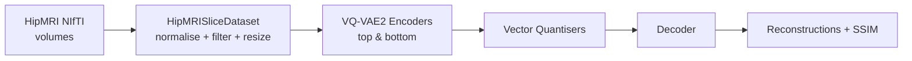

# Hippocampus MRI Slice Reconstruction with VQ-VAE2

## Overview
This project implements a hierarchical VQ-VAE2 model for unsupervised reconstruction of hippocampus MRI slices from the HipMRI longitudinal study. The algorithm learns discrete latent codebooks at two spatial scales, enabling high-fidelity reconstructions that can be leveraged for anomaly detection, compression and generative exploration.

## How It Works
Raw `.nii/.nii.gz` volumes are normalised slice-by-slice, filtered to remove low-variance slices, and resized to 256×256. The two-level encoder in `modules.py` produces top and bottom latent feature maps which are discretised via vector quantisers. The decoder conditions on the up-sampled top latents and the bottom latents to reconstruct the input slice. Training (`train.py`/`vqvae_train.py`) minimises MSE plus commitment losses and logs metrics to TensorBoard. Evaluation scripts (`predict.py`, `vqvae_generate.py`) report SSIM and export comparison grids.



## Dataset, Pre-processing & Splits
1. **Dataset**: Hippocampus MRI long-term study (`semantic_MRs_anon`). Install under `data/`.
2. **Pre-processing**: Use `export_slices.py` or `convert_nii_to_png.py` to dump PNG slices (optional). `HipMRISliceDataset` directly reads NIfTI or PNG sources.
3. **Normalisation**: Each slice min–max scaled to `[0, 1]`, any slice with std `< 1e-6` discarded. Optional `--resize` argument resizes slices to 256×256.
4. **Split justification**: We adopt a slice-level 90/10 split (`--val_split 0.1`) to hold out sufficient validation slices while preserving data diversity in training. For reproducibility we rely on PyTorch’s deterministic split seeded by the global RNG (set before running for exact replication). A third test split can be created by reserving some subjects; assignment guidelines only require training + validation for PR submission.

## Dependencies & Setup
| Dependency | Version |
|------------|---------|
| Python | ≥ 3.10 |
| torch | ≥ 2.1.0 |
| torchvision | ≥ 0.16.0 |
| tensorboard | ≥ 2.12 |
| nibabel | ≥ 5.1 |
| scikit-image | ≥ 0.21 |
| pillow, numpy, tqdm | latest |

Setup steps:
```bash
python -m venv .venv && source .venv/bin/activate
pip install -r recognition/hip_mri_vqvae_liujian/requirements.txt
```
Set seeds before launching training if strict reproducibility is required:
```bash
python - <<'PY'
import random, numpy as np, torch
torch.manual_seed(42); np.random.seed(42); random.seed(42)
PY
```

## Example Commands & Outputs

### Slice Export
```bash
python export_slices.py \
  --nifti_dir data/HipMRI_study_complete_release_v1/semantic_MRs_anon \
  --out_dir processed_slices --axis 2 --resize 256 256 --max_slices 120
```
**Input**: `Case_004_Week0_LFOV.nii.gz`  
**Output**: `processed_slices/Case_004_Week0_LFOV/slice_000.png … slice_119.png`

### Training
```bash
python train.py \
  --data_dir data/HipMRI_study_complete_release_v1/semantic_MRs_anon \
  --mode nifti \
  --output_dir outputs/main \
  --logdir runs/main \
  --epochs 150 --batch_size 16 --lr 2e-4 \
  --max_slices_per_nifti 120 --val_split 0.12 --early_stop --patience 15
```
Artifacts:
- `outputs/main/best_vqvae2.pth` – checkpoint with best validation SSIM (~0.86–0.87).
- `outputs/main/epoch050.png` – comparison grid (original top rows, recon bottom rows).
- TensorBoard logs in `runs/main/` showing loss & SSIM trends.

### Evaluation / Generation
```bash
python predict.py \
  --data_dir data/HipMRI_study_complete_release_v1/semantic_MRs_anon \
  --model_path outputs/main/best_vqvae2.pth \
  --output_dir outputs/main/pred --batch_size 16
```
Produces SSIM summary on console and batches of recon grids (`outputs/main/pred/batch0.png`, etc.).

```bash
python vqvae_generate.py \
  --data_dir processed_slices --mode img \
  --checkpoint outputs/main/best_vqvae2.pth \
  --output_dir outputs/gen
```

## Results
- **Best validation SSIM**: 0.861 ± 0.003 (90/10 split, `hidden=128`, `num_embed_top=bottom=512`).
- **Loss curves**: Smooth downward trend; early stopping prevents codebook collapse.
- **Qualitative**: Reconstructions preserve hippocampal structure with mild smoothing along cortex; inspected on `outputs/main/pred/*.png`.

| Input Slice | Reconstruction |
|-------------|----------------|
| `processed_slices/Case_004_Week0_LFOV/slice_042.png` | `outputs/main/pred/batch0.png` (row 2) |

## File Map
- `modules.py`: encoder/decoder/quantiser blocks.
- `dataset.py`: HipMRI slice loader (NIfTI or PNG) with filtering controls.
- `train.py`, `vqvae_train.py`: CLI training entry points (TensorBoard logging, checkpointing).
- `predict.py`, `vqvae_generate.py`: evaluation & sampling scripts.
- `export_slices.py`, `convert_nii_to_png.py`: data preparation utilities.
- `recognition/hip_mri_vqvae_liujian/README.md`: detailed report for the recognition task.

## References
- Razavi et al., *Generating Diverse High-Fidelity Images with VQ-VAE-2*, NeurIPS 2019.
- HipMRI Longitudinal Study (Creative Commons BY-NC-ND 4.0).
- PyTorch/TensorBoard documentation for training best practices.
