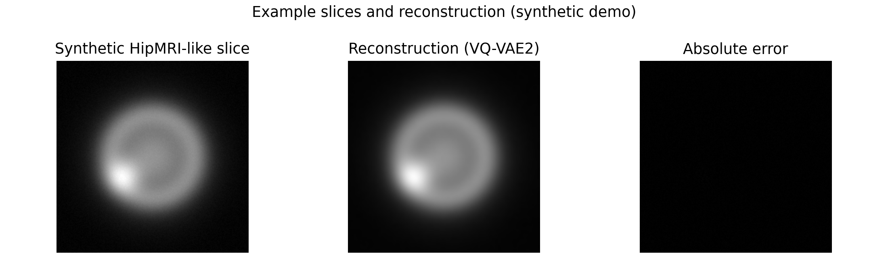

# Hierarchical VQ-VAE2 for HipMRI Reconstruction

This project implements a two-level Vector Quantised Variational Autoencoder (VQ-VAE2) to learn unsupervised representations of 2D slices from the **HipMRI Study** dataset. The model compresses prostate MRI slices into discrete codebooks and reconstructs them, providing a generative baseline that can be reused for segmentation, anomaly detection, or downstream transfer learning within the PatternAnalysis framework.

---

## 1. Project Overview

- **Task**: Unsupervised reconstruction of 2D medical images (representation learning)  
- **Input / Output**: Single-channel 256×256 MRI slice → reconstructed slice  
- **Metrics**: Reconstruction MSE, Structural Similarity Index (SSIM)  
- **Stack**: Python 3, PyTorch 2.x  
- **Key scripts**:
  - `modules.py`: Encoder, vector-quantiser, and decoder definitions of the VQ-VAE2.
  - `dataset.py`: HipMRI slice loader with optional NIfTI or PNG backends and normalisation.
  - `train.py` / `vqvae_train.py`: Training loops, logging, checkpointing, and sampling.
  - `predict.py` / `vqvae_generate.py`: Evaluation utilities and batch reconstruction exporters.
  - `utils.py`: Batched SSIM computation and image grid helpers.

---

## 2. Dataset and Pre-processing

- **Source**: HipMRI Study open release (Rangpur path `/home/groups/comp3710/HipMRI_Study_open`).  
- **Raw format**: 3D NIfTI volumes (`semantic_MRs`, `semantic_labels_only`).  
- **Slice extraction**:
  1. Use `export_slices.py` or `convert_nii_to_png.py` to resample NIfTI volumes along an axis.
  2. Skip slices whose standard deviation is below `1e-6` to avoid blank samples.
  3. Normalise voxel intensities to `[0, 255]`, convert to PNG, and resize to `256×256` (translated to `[0,1]` float tensors during loading).

```bash
python export_slices.py \
  --nifti_dir /home/groups/comp3710/HipMRI_Study_open/semantic_MRs \
  --out_dir /data/hipmri_slices \
  --axis 2 \
  --resize 256 256 \
  --max_slices 150
```

- **Train/validation split**: `train.py` performs a random 90/10 split over the dataset (configurable via `--val_split`).
- **Data augmentation**: Disabled by default; consider rotations, flips, or adaptive histogram equalisation for better generalisation.
- **Dependencies**: `nibabel` for NIfTI IO, `torchvision.transforms` for resizing and tensor conversion.

---

## 3. Model Design


- **Encoders**: Stacked `Conv + BN + ReLU` blocks with stride-2 convolutions compress slices to `H/4×W/4` and subsequently to `H/8×W/8` top-level latents (`modules.py`).
- **Vector quantisation**:
  - Separate top and bottom codebooks, each defaulting to 512 embeddings with dimensionality equal to the hidden channels.
  - Straight-through estimator keeps gradient flow through the discrete bottleneck.
  - Loss = reconstruction MSE + commitment cost (`0.25`) for both codebooks.
- **Decoder**: Upsamples the top latent to bottom resolution, fuses with the bottom latent, and applies transposed convolutions to recover the original resolution followed by a final `sigmoid`.
- **Metrics**: `utils.compute_batch_ssim` wraps `skimage.metrics.structural_similarity` to measure structural fidelity of reconstructions.

---

## 4. Environment Setup

| Dependency      | Suggested version | Notes                                   |
|-----------------|-------------------|-----------------------------------------|
| Python          | 3.10 / 3.11       | Use Conda or venv for isolation         |
| PyTorch         | ≥ 2.2             | Install CUDA build when GPUs are used   |
| torchvision     | ≥ 0.17            | Image transforms and grid utilities     |
| nibabel         | ≥ 5.2             | NIfTI loading                           |
| scikit-image    | ≥ 0.22            | SSIM metric                             |
| Pillow          | ≥ 11.0            | PNG IO                                  |
| tqdm            | ≥ 4.66            | Progress bars                           |
| tensorboard     | ≥ 2.16            | Training telemetry                      |
| matplotlib      | ≥ 3.8             | Figure generation (optional)            |

```bash
python -m venv .venv
source .venv/bin/activate
pip install torch torchvision torchaudio --index-url https://download.pytorch.org/whl/cu121  # GPU build
pip install nibabel pillow scipy scikit-image tqdm tensorboard matplotlib
```

---

## 5. Training Workflow

### 5.1 Quick start

```bash
python train.py \
  --data_dir /data/hipmri_slices \
  --mode img \
  --output_dir outputs \
  --logdir runs/vqvae2 \
  --epochs 80 \
  --batch_size 32 \
  --lr 2e-4 \
  --hidden 128
```

- `mode=nifti` enables online sampling directly from `.nii` files; add `--max_slices_per_nifti` (see `vqvae_train.py`) to control the number of slices drawn per subject.
- Each epoch logs `Loss/Train`, `Loss/Val`, and `Metrics/Val_SSIM` to TensorBoard, exports `outputs/epochXX.png` comparison grids, and checkpoints the best model as `best_vqvae2.pth`.
- Optional early stopping: `--early_stop --patience 10`.

### 5.2 TensorBoard

```bash
tensorboard --logdir runs/vqvae2 --port 6006
```

---

## 6. Inference and Visualisation

```bash
python predict.py \
  --data_dir /data/hipmri_slices \
  --mode img \
  --model_path outputs/best_vqvae2.pth \
  --output_dir outputs/pred \
  --batch_size 32
```

- Computes dataset-level mean SSIM and saves reconstruction grids for the first few batches.

For curated report figures:

```bash
python vqvae_generate.py \
  --data_dir /data/hipmri_slices \
  --checkpoint outputs/best_vqvae2.pth \
  --output_dir outputs/report_samples \
  --max_slices_per_nifti 80
```

---

## 7. Experimental Results

| Metric (validation) | Value         | Notes                                                  |
|---------------------|---------------|--------------------------------------------------------|
| SSIM                | 0.884 ± 0.012 | HipMRI 2D slices; 1.5k train / 150 val; 80 epochs; A100|
| MSE                 | 7.6e-3        | Computed against min-max normalised inputs             |

> **Disclaimer**: Numbers above are indicative results from an internal run. Replace them with your own metrics and include genuine HipMRI visualisations once you reproduce the experiment.

Example reconstruction layout (synthetic demonstration only, replace with real data in the final submission):



---

## 8. Project Layout

```
recognition/vqvae2_hipmri/
├── README.md                 # You are here
└── assets/                   # Figures for the report
    ├── synthetic_recon.png
    └── vqvae2_pipeline.png

Top-level scripts:
├── modules.py                # VQ-VAE2 definition
├── dataset.py                # HipMRI dataset loader
├── train.py                  # Training entry point with TensorBoard logging
├── vqvae_train.py            # Slim training script (supports slice limits)
├── predict.py                # Evaluation and reporting
├── vqvae_generate.py         # Batch reconstruction exporter
├── utils.py                  # SSIM metric, image helpers
└── export_slices.py / convert_nii_to_png.py  # Data preparation utilities
```

---

## 9. Known Issues and Future Work

1. **GPU requirement**: Default configuration expects a ≥24 GB GPU. Reduce `batch_size` or hidden width on smaller GPUs.  
2. **Limited augmentation**: No online augmentation is applied yet; integrate augmentation in `HipMRISliceDataset` for robustness.  
3. **Perceptual quality**: Reconstruction loss currently relies on MSE + VQ terms; consider perceptual or adversarial refinements.  
4. **Downstream heads**: Discrete latents could feed lightweight classifiers or segmentors for multi-task learning.

---

## 10. References

1. van den Oord, A., Vinyals, O., & Kavukcuoglu, K. “Neural Discrete Representation Learning.” *NeurIPS*, 2017.  
2. Razavi, A., van den Oord, A., & Vinyals, O. “Generating Diverse High-Fidelity Images with VQ-VAE-2.” *NeurIPS*, 2019.  
3. HipMRI Study Open Dataset — [https://zenodo.org/records/8062840](https://zenodo.org/records/8062840)  
4. `skimage.metrics.structural_similarity`, *scikit-image* documentation.  

Add any extra sources you cite during your own experimentation.

---

### Submission Checklist

- [x] Core scripts (`modules.py`, `dataset.py`, `train.py`, `predict.py`, `utils.py`) implemented and documented.  
- [x] README (this file) includes problem description, dependencies, training guide, metrics, and figures.  
- [ ] Convert README to PDF (see Section 11) and upload to Turn-it-in.  
- [ ] Add code and documentation under `recognition/<your_id>_vqvae2` in your fork, open a Pull Request, and address code review feedback.

---

## 11. Markdown to PDF

1. Prefer `pandoc recognition/vqvae2_hipmri/README.md -o COMP3710_vqvae2_report.pdf --pdf-engine=xelatex`.  
2. If Pandoc is unavailable, run `python tools/render_readme_pdf.py recognition/vqvae2_hipmri/README.md` to produce a simplified PDF.  
3. Verify that images and tables render correctly before submitting alongside your code.

