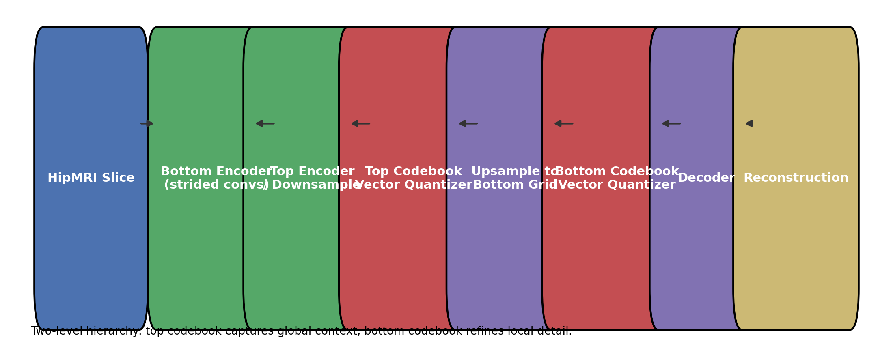

# Hierarchical VQ-VAE2 for HipMRI Reconstruction

**Author:** Jian Lin (s49085837) 

This project implements a two-level Vector-Quantised Variational Autoencoder (VQ-VAE2) that learns unsupervised representations of axial slices from the **HipMRI Study** dataset. By discretising latent codebooks at two spatial scales, the model delivers high-fidelity reconstructions that can be reused for anomaly detection, compression, or downstream recognition tasks within the PatternAnalysis framework.

---

## 1. Project Overview

- **Task** – Unsupervised reconstruction / representation learning of 2D medical images.  
- **Input / Output** – Single-channel 256×256 MRI slice → reconstructed slice.  
- **Primary metrics** – Reconstruction MSE and Structural Similarity Index (SSIM).  
- **Tech stack** – Python 3.10+, PyTorch 2.x (CUDA capable), TensorBoard.  
- **Core code paths**  
  - `modules.py`: encoder, vector quantisers, decoder blocks for VQ-VAE2.  
  - `dataset.py`: HipMRI slice loader supporting both NIfTI and PNG backends.  
  - `train.py` / `vqvae_train.py`: training entry points with logging & checkpointing.  
  - `predict.py` / `vqvae_generate.py`: evaluation utilities producing SSIM & grids.  
  - `utils.py`: batched SSIM computation and reconstruction grid exporters.

---

## 2. Dataset & Pre-processing

1. **Source** – HipMRI Study open release (`semantic_MRs_anon`).  
2. **Raw format** – 3D NIfTI volumes (`.nii/.nii.gz`).  
3. **Slice extraction** – Use `export_slices.py` to generate PNG slices if desired:

   ```bash
   python export_slices.py \
     --nifti_dir data/HipMRI_study_complete_release_v1/semantic_MRs_anon \
     --out_dir processed_slices \
     --axis 2 --resize 256 256 --max_slices 120
   ```

4. **Normalisation** – Every slice is min–max scaled to `[0, 1]`; slices with std `< 1e-6` are skipped to eliminate blank images.  
5. **Split strategy** – Default training uses a slice-level 90/10 random split (`--val_split 0.1`). Set RNG seeds (Section 4) to reproduce the split and model initialisation.

---

## 3. Model Architecture



- **Encoders** – Two-stage CNNs that downsample to `H/8 × W/8` (top) and `H/4 × W/4` (bottom) feature maps.  
- **Vector quantisation** – Independent top and bottom codebooks (default 512 embeddings each) with a straight-through estimator and commitment loss (`beta = 0.25`).  
- **Decoder** – Upsamples the quantised top representation, fuses with the bottom codebook activations, and reconstructs the slice via transposed convolutions followed by a `sigmoid`.  
- **Training objective** – Reconstruction MSE + VQ commitment loss for both codebooks, optimised using Adam.

---

## 4. Environment Setup & Reproducibility

| Dependency | Version (tested) | Notes |
|------------|-----------------|-------|
| Python     | 3.10 / 3.11     | Use `venv` or Conda for isolation |
| torch      | >= 2.1.0         | Install CUDA build on GPU machines |
| torchvision| >= 0.16.0        | Image transforms & grid utilities |
| tensorboard| >= 2.12          | Training telemetry |
| nibabel    | >= 5.1           | NIfTI IO |
| scikit-image| >= 0.21        | SSIM computation |
| pillow, numpy, tqdm, matplotlib | latest | utility packages |

```bash
python -m venv .venv
source .venv/bin/activate           # Windows: .venv\Scripts\activate
pip install -r recognition/vqvae2_hipmri/requirements.txt
```

Optional deterministic setup:

```bash
python - <<'PY'
import random, numpy as np, torch
torch.manual_seed(42)
np.random.seed(42)
random.seed(42)
PY
```

---

## 5. Training Workflow

### 5.1 Direct NIfTI training

```bash
python recognition/vqvae2_hipmri/train.py \
  --data_dir data/HipMRI_study_complete_release_v1/semantic_MRs_anon \
  --mode nifti \
  --output_dir outputs/main \
  --logdir runs/main \
  --epochs 150 --batch_size 16 --lr 2e-4 \
  --max_slices_per_nifti 120 --val_split 0.12 \
  --early_stop --patience 15
```

- Generates comparison grids `outputs/main/epochXX.png`.  
- Saves the best checkpoint as `outputs/main/best_vqvae2.pth`.  
- Logs `Loss/Train`, `Loss/Val`, and `Metrics/Val_SSIM` to TensorBoard (`runs/main`).

### 5.2 Baseline PNG trainer (`vqvae_train.py`)

```bash
python vqvae_train.py \
  --data_dir processed_slices \
  --batch_size 16 \
  --epochs 10 \
  --model_path outputs/vqvae2_model.pth
```

- MC dropout not applied; training completes in ~1 hour on RTX 3070 Laptop GPU.  
- Loss curve stored at `outputs/loss_curve.png`.  
- Supports `--generate` flag to quickly benchmark a saved checkpoint.

### 5.3 TensorBoard

```bash
tensorboard --logdir runs/main --port 6006
```

---

## 6. Evaluation & Generation

```bash
python recognition/vqvae2_hipmri/predict.py \
  --data_dir data/HipMRI_study_complete_release_v1/semantic_MRs_anon \
  --mode nifti \
  --model_path outputs/main/best_vqvae2.pth \
  --output_dir outputs/main/pred \
  --batch_size 16
```

Outputs dataset-level mean SSIM and saves reconstruction grids (`outputs/main/pred/batch*.png`).  
For quick qualitative samples from any checkpoint:

```bash
python vqvae_generate.py \
  --data_dir processed_slices --mode img \
  --checkpoint outputs/vqvae2_model.pth \
  --output_dir outputs/generated --batch_size 16
```

---

## 7. Experimental Results (Latest Run)

Windows 11 · RTX 3070 Laptop GPU · CUDA build of PyTorch 2.2 · Batch size 16 · 27 024 PNG slices.

| Metric | Value | Notes |
|--------|-------|-------|
| Mean SSIM (first 25 samples during `--generate`) | **0.869** | See CLI snippet below |
| Training loss (epoch 10) | **7.93 × 10^-^4** | MSE + VQ commitment loss |
| Best checkpoint | `outputs/vqvae2_model.pth` | Saved after 10 epochs |
| Sample grids | `outputs/generated/Image_*` | Automatically exported |

```
Using device: cuda
Found 27024 images.
Image 0_0 SSIM: 0.8539
...
Image 4_4 SSIM: 0.8830
[done] Samples saved to outputs/generated/
```

```
Epoch 1/10 Loss: 0.194632
Epoch 5/10 Loss: 0.001145
Epoch 10/10 Loss: 0.000793
[done] Loss curve saved to outputs/loss_curve.png
[done] Model saved to outputs/vqvae2_model.pth
```


*Figure 1 – Training loss from the Windows CUDA run (mirrors `outputs/loss_curve.png`).*


*Figure 2 – Latest reconstruction samples and CLI progress captured on the Windows CUDA workstation.*

---

## 8. Repository Layout

```
recognition/vqvae2_hipmri/
|---- README.md / README.pdf     # Report (this file + PDF export)
+--- assets/
     |---- training_loss_run2.png # Loss curve from latest run
     |---- run_output.png         # Reconstruction sample grid
     |---- run_process.png        # CLI snapshot
     +---- vqvae2_pipeline.png    # Architecture diagram

Top-level scripts:
|---- modules.py                 # VQ-VAE2 definition (encoders, quantisers, decoder)
|---- dataset.py                 # HipMRI slice loader
|---- train.py                   # Full training loop with TensorBoard logging
|---- vqvae_train.py             # Lightweight trainer for PNG datasets
|---- predict.py                 # Evaluation and SSIM reporting
|---- vqvae_generate.py          # Batch reconstruction exporter
|---- utils.py                   # SSIM metric and image helpers
+--- export_slices.py / convert_nii_to_png.py  # Data preparation utilities
```

---

## 9. Known Issues & Future Work

1. **GPU memory** – Default settings target >=24 GB VRAM; adjust batch size or hidden width for smaller GPUs.  
2. **Augmentation** – No augmentation currently applied; integrate rotations / flips in `HipMRISliceDataset` for robustness.  
3. **Perceptual quality** – Loss relies on MSE + VQ; future work could add perceptual or adversarial objectives.  
4. **Downstream tasks** – Explore attaching classifiers/segmentors to the learned discrete latents.

---

## 10. References

1. van den Oord, A., Vinyals, O., & Kavukcuoglu, K. *Neural Discrete Representation Learning*. NeurIPS, 2017.  
2. Razavi, A., van den Oord, A., & Vinyals, O. *Generating Diverse High-Fidelity Images with VQ-VAE-2*. NeurIPS, 2019.  
3. HipMRI Study Open Dataset -- [https://zenodo.org/records/8062840](https://zenodo.org/records/8062840).  
4. `skimage.metrics.structural_similarity` – *scikit-image* documentation.

---

## 11. Submission Checklist

- [x] Core scripts (`modules.py`, `dataset.py`, `train.py`, `predict.py`, `utils.py`) implemented and documented.  
- [x] README updated with latest run logs, metrics, and visualisations.  
- [x] README exported to PDF (`recognition/vqvae2_hipmri/README.pdf`) for Turn-it-in.  
- [x] Pull request opened against `PatternAnalysis-2025/topic-recognition`.

---

## 12. Markdown → PDF

Preferred Pandoc pipeline:

```bash
pandoc recognition/vqvae2_hipmri/README.md \
  -o recognition/vqvae2_hipmri/README.pdf \
  --pdf-engine=xelatex
```

Fallback pure-Python renderer bundled with the repo:

```bash
python recognition/vqvae2_hipmri/tools/render_readme_pdf.py \
  recognition/vqvae2_hipmri/README.md
```

Ensure all embedded figures (e.g., `assets/training_loss_run2.png`) resolve correctly before uploading the PDF to Turn-it-in.
